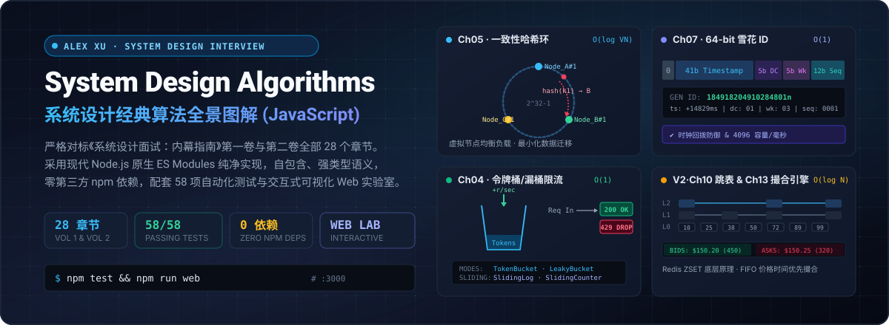

<p align="center">
  
</p>

<p align="center">
  <a href="https://nodejs.org/"></a>
  <a href="https://system-design-algorithms-js.xiaosang.cc/"></a>
  <a href="https://github.com/holynova/system-design-algorithms-js/actions"></a>
  <a href="#-设计规范与工程特色"></a>
  <a href="./LICENSE"></a>
</p>

---

## 🎯 解决的核心痛点 (Value Proposition)

在技术面试与分布式系统设计实践中，候选人与工程师往往面临**“概念懂很多，动手写不出”**的困境：
- 能够背出**一致性哈希**的基本原理，却写不出一套带虚拟节点负载分布与二分顺时针寻址的高性能路由环；
- 了解 **Twitter Snowflake** 的 64 位比特布局，却在位运算溢出防御、时钟回拨处理与 4096 容量溢出等待上漏洞百出；
- 知道 **LRU / LFU 缓存** 和 **Redis 跳表** 的存在，却不曾真正手写过双向链表哈希桶与多层随机前向指针的高效实现；
- 熟悉限流概念，却未曾亲手对比过**令牌桶、漏桶、固定窗口、滑动窗口日志与滑动窗口计数器**这五种工业级限流算法的边界行为。

本项目基于 **Alex Xu 经典名作《System Design Interview: An Insider's Guide》（系统设计面试：内幕指南）** 第一卷与第二卷的全部 **28 个章节**，使用现代 JavaScript (**Node.js 原生 ES Modules**) 完整实现了书中的全部核心算法与底层数据结构。

**坚持三大原则**：
1. **可读性第一**：去除冗余工程脚手架，代码即教科书；
2. **零第三方依赖**：所有算法不依赖任何外部 npm 库，裸机原生运行；
3. **自包含可运行**：每个算法文件均内置可独立执行的终端 Demo，并附带完备的单元测试与可视化实验门户。

---

## 🌐 在线体验与交互演示 (Live Demos)

| 访问入口 | 地址 | 说明 |
| :--- | :--- | :--- |
| 🚀 **Cloudflare 全球 CDN** | [system-design-algorithms-js.xiaosang.cc](https://system-design-algorithms-js.xiaosang.cc/) | 极速镜像节点，自定义域名直连 |
| 📦 **GitHub Pages** | [holynova.github.io/system-design-algorithms-js](https://holynova.github.io/system-design-algorithms-js/) | 官方主页托管，实时自动化部署 |
| 💻 **GitHub 源码仓库** | [github.com/holynova/system-design-algorithms-js](https://github.com/holynova/system-design-algorithms-js) | 欢迎 Star 与 Fork 共同研习 |

### 📱 手机扫码直达
扫描下方二维码，在手机端即可直接操作全套 28 章算法交互实验室：

<p align="center">
  
</p>

---

## 🖥 交互式可视化 Web 门户 (Interactive Web Lab)

本项目内置开箱即用的离线/在线 Web 门户，涵盖所有 28 章的**核心原理图解、精美 SVG 架构拓扑、Mermaid 状态时序图、算法在线实时操练台与全量源码浏览器**：

<p align="center">
  
</p>

- **在线交互操练台 (Interactive Playgrounds)**：
  - **限流器实时流量注入**：调整令牌注入速率与容量，观察高并发压测下的 200 OK 与 429 Too Many Requests 丢包曲线；
  - **雪花 ID 实时发号与逆向解析**：实时生成 64 位 BigInt ID，并将其拆解为毫秒时间戳、数据中心 ID、机器 Worker ID 与序列号；
  - **一致性哈希环与节点扩缩容模拟**：动态增删节点与配置虚拟节点倍率，可视化查看顺时针键命中与数据迁移倾斜度；
  - **Limit Order Book 实时撮合**：提交限价买卖单，观察盘口价差（Spread）、部分成交以及深度梯级变动。

---

## 📚 28 章节核心算法与数据结构全景目录 (Algorithm Catalog)

### 📘 第一卷：系统设计核心组件与基础服务 (Volume 1)

| 章节 | 核心主题 | 经典算法与数据结构实现 | 源码路径 | 算法复杂度 |
| :--- | :--- | :--- | :--- | :--- |
| **Ch01** | 从零到百万用户 | **LRU / LFU 缓存淘汰算法**<br>• 双向链表 + Map 实现严格 $O(1)$ LRU<br>• 多频次链表桶实现严格 $O(1)$ LFU | [`lru-cache.js`](src/v1/ch01-cache/lru-cache.js)<br>[`lfu-cache.js`](src/v1/ch01-cache/lfu-cache.js) | Get/Put: $O(1)$ |
| **Ch02** | 粗略容量估算 | **容量计算器与数据延迟表**<br>• QPS、峰值系数、存储容量、网络带宽、Pareto 80/20 缓存内存<br>• Jeff Dean 延迟常数表与 2 的幂阶换算 | [`capacity-calculator.js`](src/v1/ch02-estimation/capacity-calculator.js) | $O(1)$ |
| **Ch03** | 系统设计面试框架 | **4 步面试法评估器与自查清单**<br>• 需求范围梳理、高层架构、深入细节、演进与总结自测模型 | [`interview-evaluator.js`](src/v1/ch03-framework/interview-evaluator.js) | $O(1)$ |
| **Ch04** | 设计分布式限流器 | **五大工业级限流算法全套实现**：<br>1. 令牌桶 (Token Bucket 惰性填充)<br>2. 漏桶 (Leaky Bucket 恒定漏水削峰)<br>3. 固定窗口计数器 (Fixed Window)<br>4. 滑动窗口日志 (Sliding Window Log 纳秒精细清理)<br>5. 滑动窗口计数器 (Sliding Window Counter 加权近似) | [`token-bucket.js`](src/v1/ch04-rate-limiter/token-bucket.js)<br>[`leaky-bucket.js`](src/v1/ch04-rate-limiter/leaky-bucket.js)<br>[`fixed-window.js`](src/v1/ch04-rate-limiter/fixed-window.js)<br>[`sliding-window-log.js`](src/v1/ch04-rate-limiter/sliding-window-log.js)<br>[`sliding-window-counter.js`](src/v1/ch04-rate-limiter/sliding-window-counter.js) | 常数级 $O(1)$<br>(日志为 $O(M)$) |
| **Ch05** | 一致性哈希 | **一致性哈希环 (Consistent Hashing Ring)**<br>• 虚拟节点 (Virtual Nodes) 消除负载倾斜<br>• 二分查找二叉树/有序数组顺时针后继节点<br>• 扩缩容最小化节点键迁移量追踪 | [`consistent-hash-ring.js`](src/v1/ch05-consistent-hash/consistent-hash-ring.js) | Lookup: $O(\log(M \cdot V))$ |
| **Ch06** | 分布式 KV 存储 | **分布式存储四大支柱算法**：<br>1. 向量时钟 (Vector Clock 因果版本检测与分支合并)<br>2. 默克尔树 (Merkle Tree 反熵差异快速定位)<br>3. 布隆过滤器 (Bloom Filter 双哈希极低空间判存)<br>4. 流言协议 (Gossip Protocol 节点心跳与故障检测)<br>5. 法定人数共识 (Quorum Consensus $W + R > N$) | [`vector-clock.js`](src/v1/ch06-kv-store/vector-clock.js)<br>[`merkle-tree.js`](src/v1/ch06-kv-store/merkle-tree.js)<br>[`bloom-filter.js`](src/v1/ch06-kv-store/bloom-filter.js)<br>[`gossip-protocol.js`](src/v1/ch06-kv-store/gossip-protocol.js)<br>[`quorum-consensus.js`](src/v1/ch06-kv-store/quorum-consensus.js) | 树比对: $O(\log N)$<br>布隆: $O(K)$ |
| **Ch07** | 分布式唯一 ID | **Twitter Snowflake 64 位雪花算法**<br>• 64 位 BigInt 结构 (符号位 + 41位时间戳 + 5位机房 + 5位机器 + 12位序列号)<br>• 时钟回拨防御、同毫秒 4096 溢出等待与反向解析器 | [`snowflake.js`](src/v1/ch07-unique-id/snowflake.js) | $O(1)$ |
| **Ch08** | 短网址系统 | **短码生成与哈希碰撞算法**：<br>1. Base62 双向双射编解码 (自增 ID 压缩)<br>2. 截断哈希加盐线性探测冲突解决器 | [`base62.js`](src/v1/ch08-url-shortener/base62.js)<br>[`short-hash-resolver.js`](src/v1/ch08-url-shortener/short-hash-resolver.js) | $O(\log_{62} N) \approx O(1)$ |
| **Ch09** | 分布式网络爬虫 | **爬虫调度与指纹查重**：<br>1. 礼貌性与优先级 URL Frontier (双层队列 + 域名速率限制)<br>2. SimHash 局部敏感哈希 (64 位指纹与海明距离相似度) | [`polite-url-frontier.js`](src/v1/ch09-crawler/polite-url-frontier.js)<br>[`sim-hash.js`](src/v1/ch09-crawler/sim-hash.js) | SimHash: $O(L)$<br>Frontier: $O(1)$ |
| **Ch10** | 分布式通知系统 | **高可靠投递与防重**：<br>1. 指数退避重试 (Full Jitter / Equal Jitter 消除惊群)<br>2. 幂等性去重器 (Idempotency Key 滑动窗口防重入) | [`exponential-backoff.js`](src/v1/ch10-notification/exponential-backoff.js)<br>[`idempotency-deduplicator.js`](src/v1/ch10-notification/idempotency-deduplicator.js) | $O(1)$ |
| **Ch11** | 新闻提要信息流 | **信息流分发与归并**：<br>1. 推拉结合混合扇出模型 (Hybrid Fan-out)<br>2. 多路时间线优先队列 K 路归并 (K-Way Merge with Heap) | [`hybrid-fanout.js`](src/v1/ch11-news-feed/hybrid-fanout.js)<br>[`timeline-merger.js`](src/v1/ch11-news-feed/timeline-merger.js) | 归并: $O(N \log K)$ |
| **Ch12** | 实时聊天系统 | **消息定序与在线感知**：<br>1. 会话级单调有序序列号分配器与空洞检测 (Gap Detection)<br>2. 心跳感知与超时下线管理器 (Presence Manager) | [`message-sequencer.js`](src/v1/ch12-chat/message-sequencer.js)<br>[`presence-manager.js`](src/v1/ch12-chat/presence-manager.js) | $O(1)$ |
| **Ch13** | 搜索自动补全 | **带 Top-K 预计算的前缀树 (Prefix Trie with Top-K)**<br>• 沿途节点缓存高频热词，输入前缀 $O(p)$ 瞬时检索响应 | [`topk-trie.js`](src/v1/ch13-autocomplete/topk-trie.js) | 查询: $O(p)$<br>插入: $O(p \cdot K \log K)$ |
| **Ch14** | YouTube 视频处理 | **DAG 视频转码任务调度器**<br>• 拓扑排序 (Topological Sorting) 与入度计算<br>• 任务依赖环检测与流水线并行执行仿真 | [`dag-task-scheduler.js`](src/v1/ch14-youtube/dag-task-scheduler.js) | $O(V + E)$ |
| **Ch15** | Google Drive 网盘 | **块级差量同步与去重算法 (Delta Sync & Deduplication)**<br>• 文件切块、内容寻址哈希比对与变动块增量传输 | [`delta-sync.js`](src/v1/ch15-google-drive/delta-sync.js) | $O(\text{Chunks})$ |

---

### 📕 第二卷：高并发大规模实战系统 (Volume 2)

| 章节 | 核心主题 | 经典算法与数据结构实现 | 源码路径 | 算法复杂度 |
| :--- | :--- | :--- | :--- | :--- |
| **Ch01** | 邻近位置服务 | **地理空间索引算法**：<br>1. GeoHash (经纬度转 Base32 编码及 8 邻域相邻九宫格搜索)<br>2. 空间四叉树 (QuadTree 自适应象限分裂与范围检索) | [`geohash.js`](src/v2/ch01-proximity/geohash.js)<br>[`quad-tree.js`](src/v2/ch01-proximity/quad-tree.js) | GeoHash: $O(1)$<br>QuadTree: $O(\log N)$ |
| **Ch02** | 附近的好友 | **地理位置动态订阅与距离计算**：<br>1. Haversine 球面大圆距离公式 (地球表面物理距离)<br>2. 空间网格发布订阅追踪器 (Grid Pub/Sub 移动通知) | [`haversine.js`](src/v2/ch02-nearby-friends/haversine.js)<br>[`grid-pubsub.js`](src/v2/ch02-nearby-friends/grid-pubsub.js) | $O(1)$ |
| **Ch03** | 谷歌地图 | **路径规划与地图瓦片算法**：<br>1. A* 启发式路网寻路算法 (欧几里得启发函数与优先队列)<br>2. Slippy Map 瓦片金字塔坐标换算 (经纬度与行列号映射) | [`astar-pathfinding.js`](src/v2/ch03-google-maps/astar-pathfinding.js)<br>[`slippy-map-tile.js`](src/v2/ch03-google-maps/slippy-map-tile.js) | A*: $O(E + V \log V)$<br>瓦片: $O(1)$ |
| **Ch04** | 分布式消息队列 | **存储与消费分配算法**：<br>1. 追加日志与稀疏索引二分查找 (Segmented Commit Log & Sparse Index)<br>2. 消费组再均衡分配策略 (Range & Round-Robin Assignor) | [`commit-log.js`](src/v2/ch04-message-queue/commit-log.js)<br>[`partition-assignor.js`](src/v2/ch04-message-queue/partition-assignor.js) | 读取: $O(\log S + I)$<br>分配: $O(P + C)$ |
| **Ch05** | 指标监控与告警 | **时序数据流算法**：<br>1. 时序数据时桶降采样 (Bucket Downsampling & Aggregation)<br>2. 滑动窗口告警规则评估器 (连续 N 次阈值超标状态机) | [`time-series-downsampler.js`](src/v2/ch05-metrics/time-series-downsampler.js)<br>[`alert-window-evaluator.js`](src/v2/ch05-metrics/alert-window-evaluator.js) | 降采样: $O(N)$<br>评估: $O(1)$ |
| **Ch06** | 广告点击事件聚合 | **流处理窗口与水位线**：<br>1. 基于事件时间的水位线推进机制 (Watermark)<br>2. 翻滚窗口聚合与迟到乱序事件旁路隔离 (Side Output) | [`watermark-stream-window.js`](src/v2/ch06-ad-aggregation/watermark-stream-window.js) | $O(1)$ 每事件 |
| **Ch07** | 酒店预订系统 | **跨日期库存防超卖算法**：<br>1. 跨多晚预订原子锁定与版本号乐观锁 (Optimistic Lock)<br>2. 租期锁定与超时自动释放机制 (Hold with TTL) | [`inventory-reservation.js`](src/v2/ch07-hotel-reserve/inventory-reservation.js) | $O(\text{Dates})$ |
| **Ch08** | 分布式邮件服务 | **邮件全文检索算法**：<br>1. 倒排索引构建器 (Inverted Index 分词与倒排链表)<br>2. 布尔检索与倒排列表求交并集 (AND, OR, NOT) | [`inverted-index.js`](src/v2/ch08-email-search/inverted-index.js) | 检索: $O(L_1 + L_2)$ |
| **Ch09** | 类 S3 对象存储 | **纠删码容灾算法 (Erasure Coding)**：<br>1. $N$ 数据块 + $M$ 校验块矩阵编码生成<br>2. 任意损坏 $M$ 块下的无损数学重建与数据恢复 | [`erasure-coding.js`](src/v2/ch09-s3-storage/erasure-coding.js) | 编解码: $O(N \cdot M)$ |
| **Ch10** | 实时游戏排行榜 | **跳表完整实现 (Skip List - Redis ZSET 核心底层)**：<br>1. 多层随机前向指针与跨度 (Span 计算)<br>2. $O(\log N)$ 插入、删除与名次 Rank 精确检索<br>3. 范围获取 Top-K 玩家排行榜 | [`skip-list.js`](src/v2/ch10-leaderboard/skip-list.js) | 插入/排名: $O(\log N)$<br>Top-K: $O(K)$ |
| **Ch11** | 金融支付系统 | **金融支付正确性保障**：<br>1. 复式记账法账本 (借贷平衡与不可变审计流水)<br>2. 双向对账算法 (内部账本与外部银行清算单差异对齐) | [`double-entry-ledger.js`](src/v2/ch11-payment/double-entry-ledger.js)<br>[`payment-reconciliation.js`](src/v2/ch11-payment/payment-reconciliation.js) | 记账: $O(1)$<br>对账: $O(N + M)$ |
| **Ch12** | 数字钱包系统 | **分布式事务模式**：<br>1. Saga 编排器与逆向补偿回滚 (Saga Orchestrator)<br>2. 两阶段提交状态机仿真 (Two-Phase Commit 2PC) | [`saga-orchestrator.js`](src/v2/ch12-wallet/saga-orchestrator.js)<br>[`two-phase-commit.js`](src/v2/ch12-wallet/two-phase-commit.js) | $O(\text{Steps})$ |
| **Ch13** | 股票交易所 | **撮合引擎与限价订单簿 (Limit Order Book)**：<br>1. 价格优先、时间优先原则 (Price-Time Priority FIFO)<br>2. 买卖双向撮合成交 (支持挂单、撤单与部分撮合) | [`matching-engine.js`](src/v2/ch13-exchange/matching-engine.js) | 撮合: $O(\text{Matches})$ |

---

## ⚡️ 快速上手与运行 (Quick Start)

本项目采用纯粹的 **Node.js 原生 ES Modules**，在 Node.js $\ge$ 18 环境下无需执行任何 `npm install`：

### 1. 运行全量 58 项自动化单元测试
```bash
npm test
```
> 包含 30 个独立测试套件、58 项核心测试用例，100% 通过（耗时通常小于 200ms）。

### 2. 启动本地交互式可视化 Web 门户
```bash
npm run web
```
终端将启动原生 HTTP 服务器，浏览器访问 `http://localhost:3000` 即可在本地进行交互实验与架构研读。

### 3. 运行全算法终端高亮演示
```bash
npm run demo
```
一键运行全量算法的控制台控制台输入输出与边界演示。

### 4. 单独运行某一个算法的自包含演示
每个算法源码均自包含完整 Demo，可直接使用 node 执行：
```bash
# 体验跳表排行榜与 Rank 名次计算
node src/v2/ch10-leaderboard/skip-list.js

# 体验股票撮合引擎买卖单连续撮合
node src/v2/ch13-exchange/matching-engine.js

# 体验一致性哈希环虚拟节点与迁移测试
node src/v1/ch05-consistent-hash/consistent-hash-ring.js

# 体验令牌桶高并发限流
node src/v1/ch04-rate-limiter/token-bucket.js
```

---

## 🛠 设计规范与工程特色

1. **教学注释详尽**：每个算法源文件顶部均详细记录了原书设计背景、算法数学模型、ASCII 拓扑示意图与时间/空间复杂度分析；
2. **纯粹原生实现**：不依赖 lodash、uuid、big.js 等任何外部包，展现指针位移、BigInt 位运算与状态机的本质机理；
3. **防御性工程设计**：严密覆盖时钟回拨处理、哈希环回绕、同分平局打破、边界截断等真实工业级分布式系统高危踩坑点；
4. **双向学习闭环**：结合 [CATALOG.md](./CATALOG.md) 索引与 Web 交互实验室，形成“阅读原书 $\to$ 运行代码 $\to$ 在线调参 $\to$ 面试表达”的完整学习闭环。

---

## 📄 许可协议 (License)

本项目采用 [MIT License](./LICENSE) 开源协议。欢迎学习、交流与引用。
